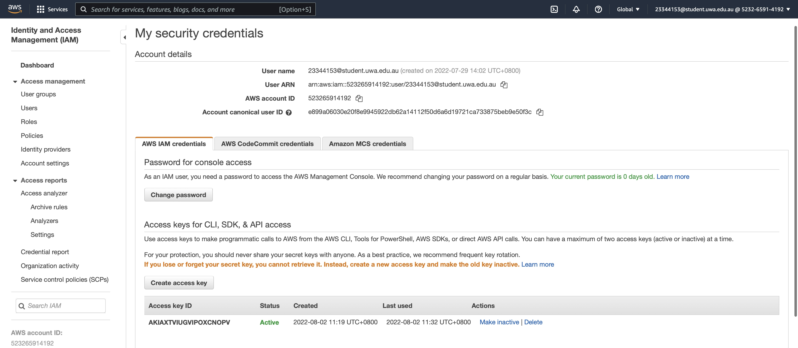
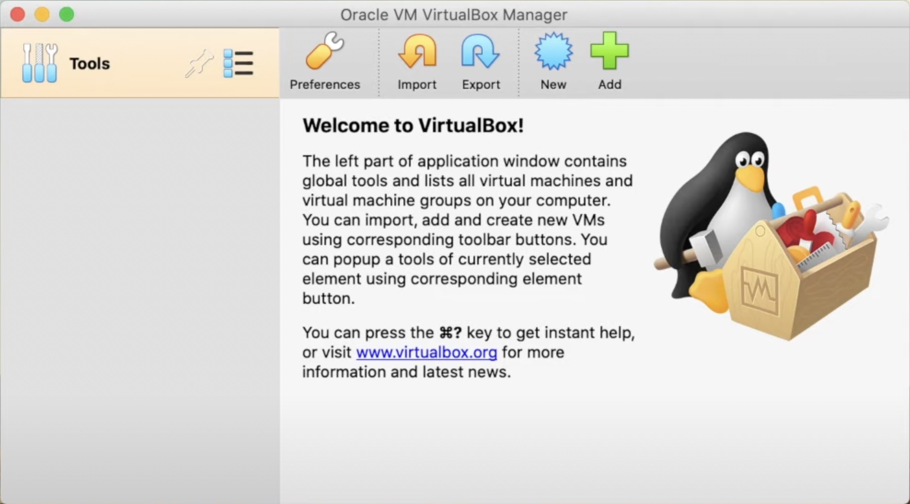
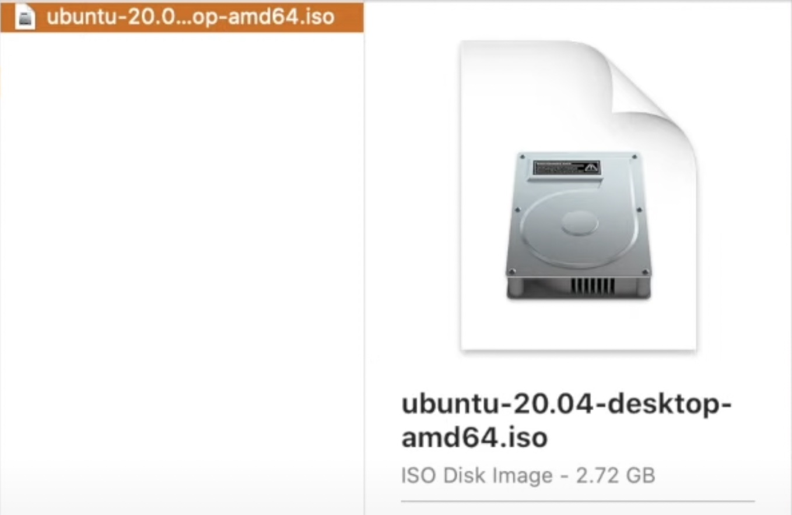
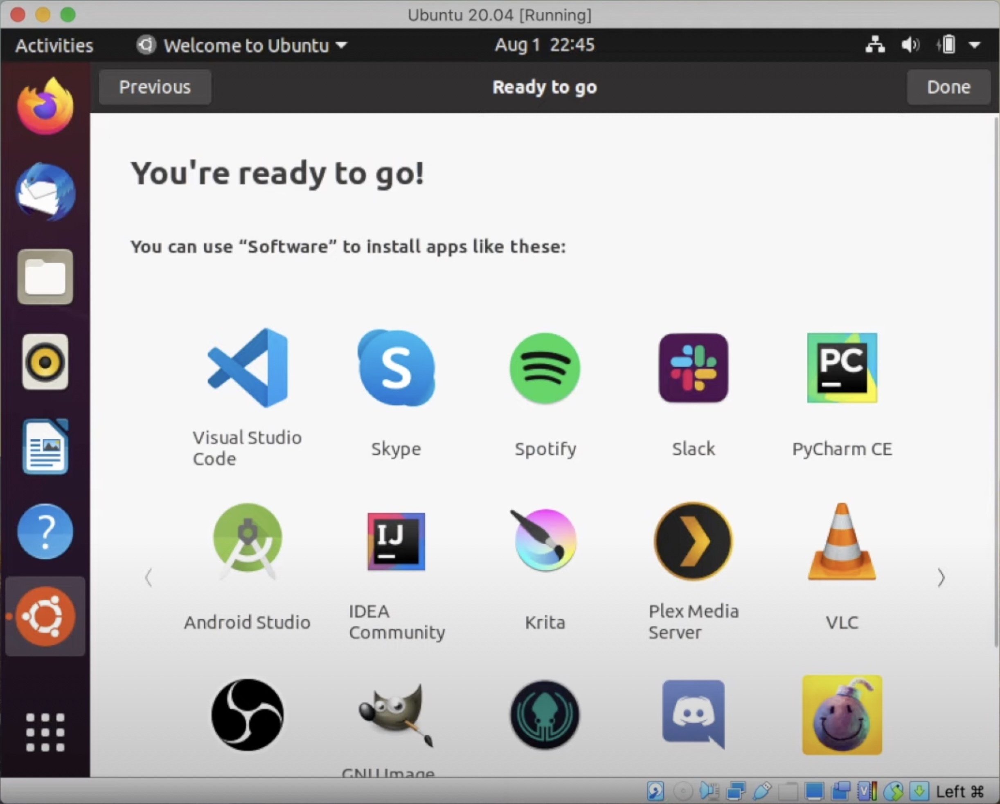
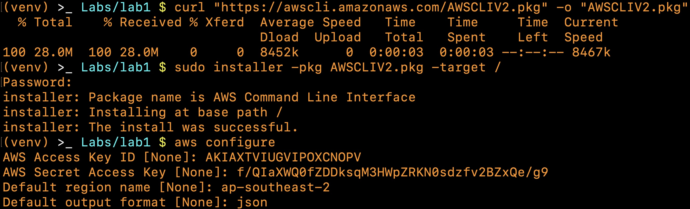
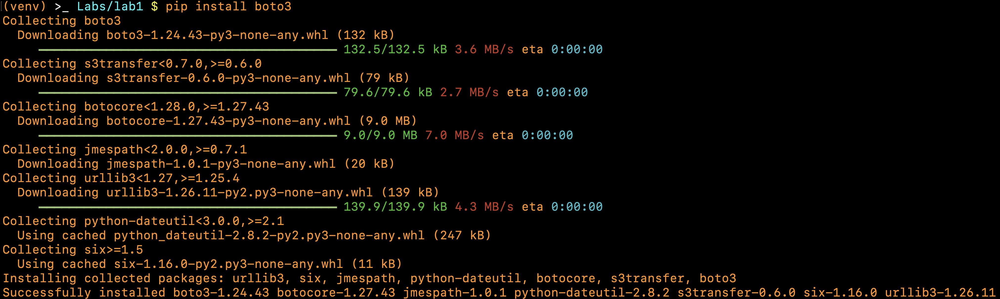
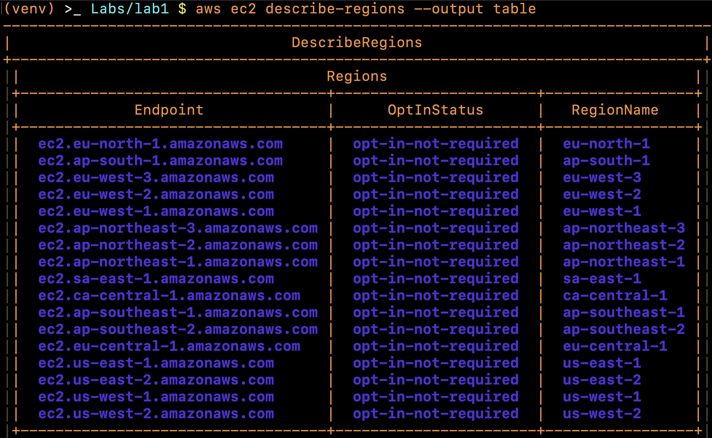
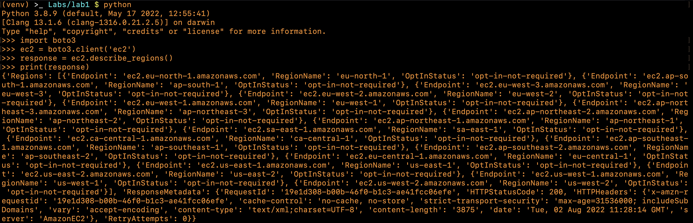
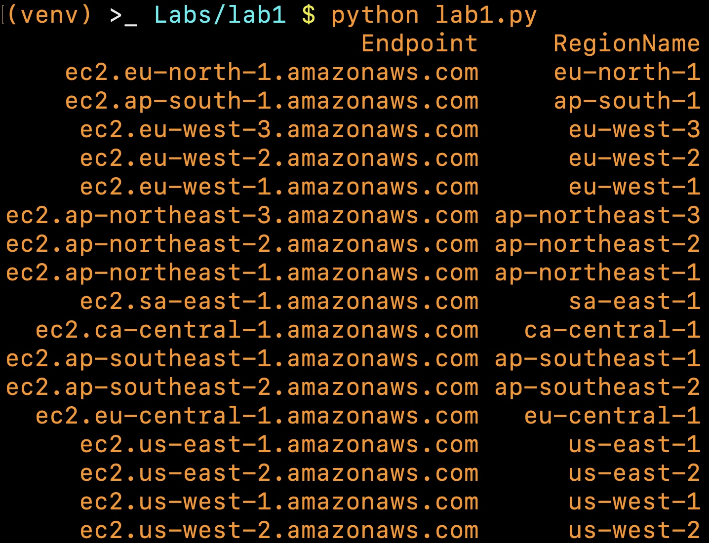

# Practical Worksheet 1

## AWS Accounts and Log In

### Search and open Identity Access Management



## Virtual Box and Ubuntu VM

### Download and install the appropriate version of VirtualBox



### Download Ubuntu 20.04 LTS iso



### Setup VM



## AWSCLI, Boto and Python 3.8.x

### Install Python 3.8.x


### Install awscli



### Install boto3



## Exploring and testing the environment

### Test the aws environment by running



### Test the python environment



### Put this code into a python file and tabulate the print to have 2 columns with Endpoint and RegionName

```python
'''lab1.py'''
import boto3
import pandas

ec2 = boto3.client('ec2')
response = ec2.describe_regions()
df = pandas.DataFrame(response['Regions'])
print(df.drop('OptInStatus', axis=1).to_string(index=False))
```

Running `lab1.py`.


