# Practical Worksheet 2

## Create an EC2 instance using awscli

### Create a security group

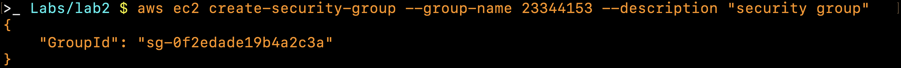

Security group named `23344153` is created with the description of `security group` and the group ID is returned from the command.

### Authorise inbound traffic for ssh

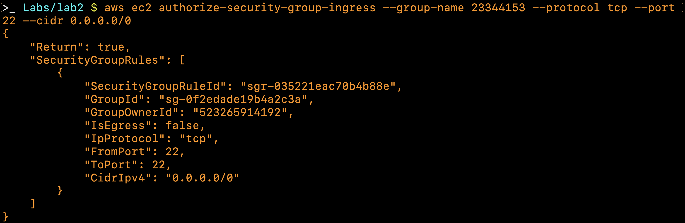

An ingress rule that allows any `IPv4` address to connect under the `TCP` protocol on port `22` which is `SSH` is added to the security group `23344153`.

### Create a key pair that will allow you to ssh to the EC2 instance

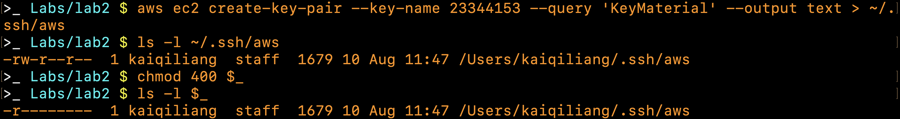

A key pair with the name `23344153` is created and the output is the private key which is redirected to the file `~/.ssh/aws` with its permission changed to readonly to the owner of the file as shown by the `ls -l` command.

### Create the instance and note the instance id

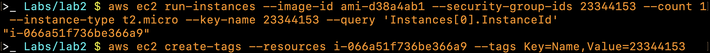

A `t2.micro` type of `ec2` instance of a particular Ubuntu image (specified by the `ami`) is created with the security group and key pair specified to be `23344153` created earlier. A tag of `23344153` is also attached to the instance so that it can be identified easily.

### Get the public IP address

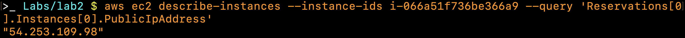

Using the instance ID output from the previous step the public IP address of the instance can be queried and outputted to the terminal.

### Connect to the instance

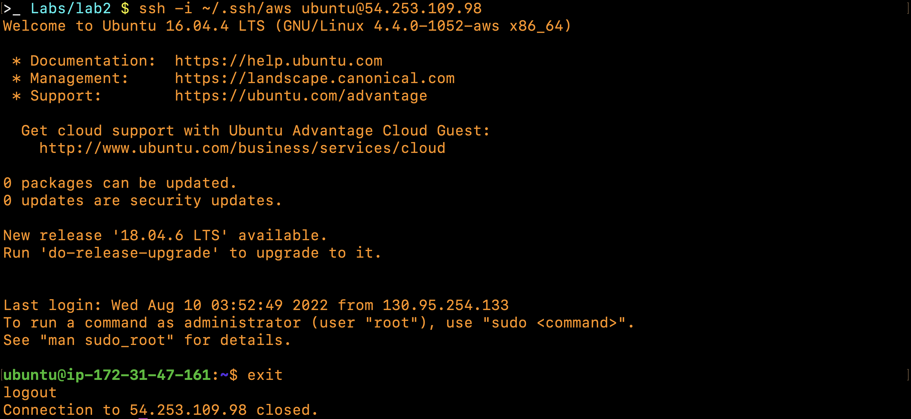

Using the `ssh` command the `ec2` instance can be connected to remotely through its public IP address and authenticated using the private key saved in the `.ssh` directory.

### Look at the instance using the AWS console

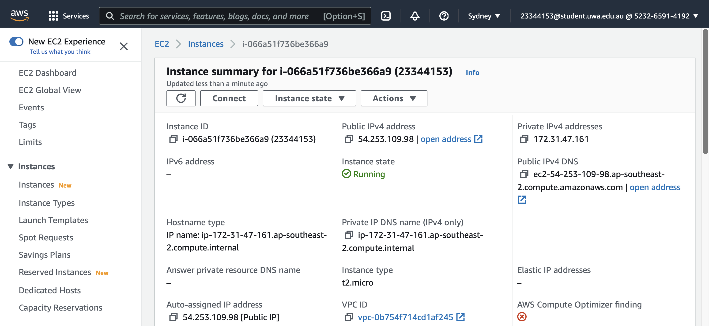
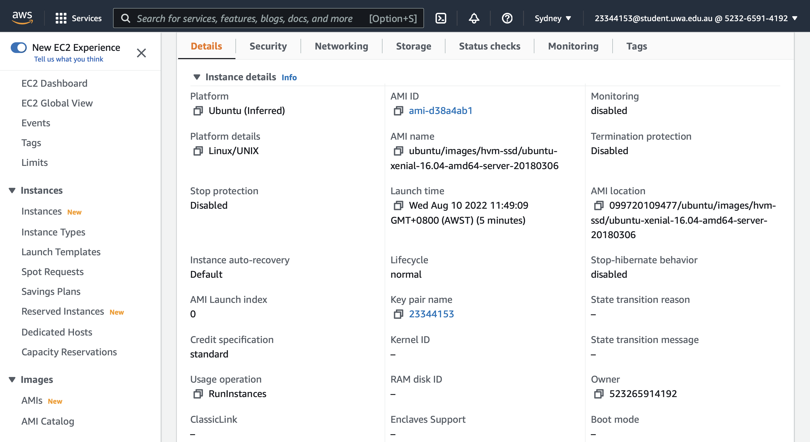

The Public IPv4 address, instance ID and security group of the `ec2` instance created through the terminal all match the information found on the aws console.

### Terminate the instance

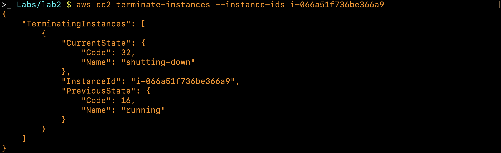

After terminating the `ec2` instance it outputs the previous state as `running` and the current state as `shutting-down` because it does not terminate immediately, it takes some time to shut down the instance.

## Create an EC2 instance with Python Boto script

### Repeat the steps above using the equivalent Boto commands in a python script. The script should output the IP address to connect to

```python
'''lab2.py'''
import boto3

client = boto3.client('ec2')
ec2 = boto3.resource('ec2')

# create a security group given the group name and description
security_group_id = client.create_security_group(
    GroupName='23344153-sg',
    Description='Security Group'
)['GroupId']

# print out security group ID and Vpc ID
vpc_id = client.describe_vpcs().get('Vpcs', [{}])[0].get('VpcId', '')
print(f'Security Group Created {security_group_id} in vpc {vpc_id}.', end='\n\n')

# Add inbound rule for the given security group ID
data = client.authorize_security_group_ingress(
    GroupId=security_group_id,
    IpPermissions=[{
        'IpProtocol': 'tcp',
        'FromPort': 22,
        'ToPort': 22,
        'IpRanges': [{'CidrIp': '0.0.0.0/0'}]
    }]
)
print(f'Ingress Successfully Set {data}', end='\n\n')

# create key pair given a key name
keyname = '23344153-key'
print(client.create_key_pair(KeyName=keyname), end='\n\n')

# create an ec2 instance given ami, the number of instances, type, key and security group
instance = ec2.create_instances(
    ImageId='ami-d38a4ab1',
    MaxCount=1,
    MinCount=1,
    InstanceType='t2.micro',
    KeyName=keyname,
    SecurityGroupIds=[security_group_id]
)[0]
print(instance.id, end='\n\n')

# wait for the instance to launch
instance.wait_until_running()
response = client.describe_instances(InstanceIds=[instance.id])

# once its running print out the public IP address
print(response['Reservations'][0]['Instances'][0]['PublicIpAddress'])
```

Running `lab2.py`.

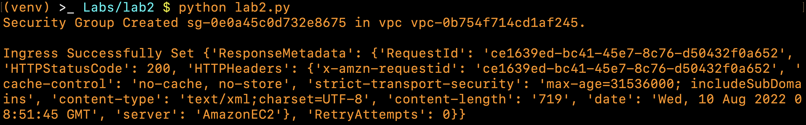
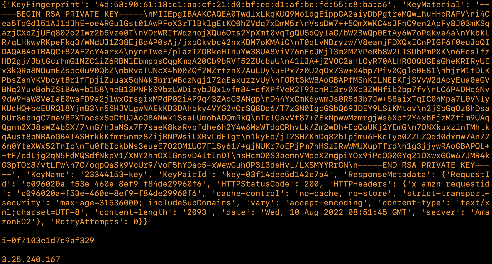

## Using Docker

### Check the version


Docker version 20.10.17 has been installed on the system and added to the path.

### Build and run an httpd container

#### Create a directory called html


A `html` directory has been created and changed into that directory.

#### Edit a file index.html inside the html directory

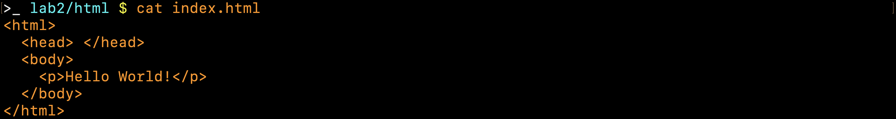

An `index.html` file is created with the content of `Hello World!` in a `p` tag.

### Create a file called `Dockerfile` outside the html directory


A `Dockerfile` is created outside the `html` directory with the content of 2 instructions. First to create a `httpd` image of version 2.4. Second to copy the `html` directory to the `usr/local/apache/htdocs` directory in filesystem of the image.

### Build the docker image

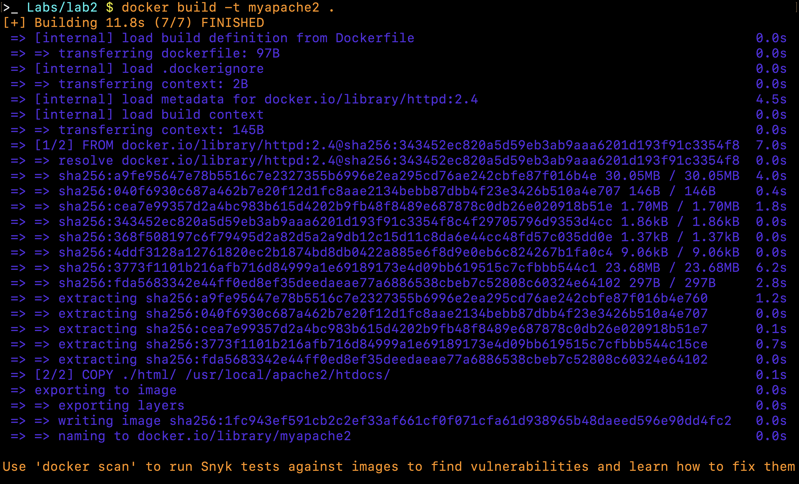

The 2 instructions specified in the `Dockerfile` is executed successfully step by step and a docker image named `myapache2` is created.

### Run the image

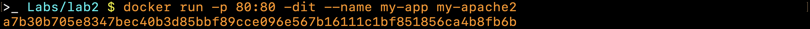

A container of the docker image named `my-app` is launched on port 80.

### Open a browser and access address <http://localhost> or <http://127.0.0.1> Confirm you get Hello World

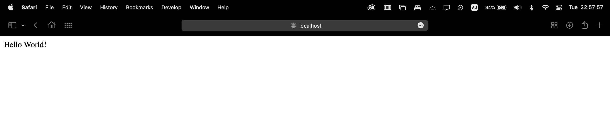

The default port `http` uses is 80 so through the URL `localhost` on a browser the docker container can be accessed.

### Other commands

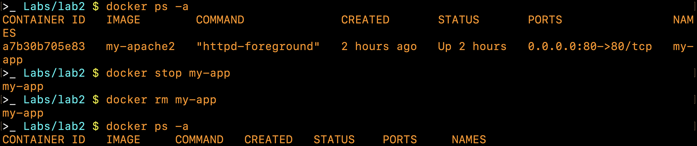

After stopping and removing the docker container the name `my-app` is no longer visible.
