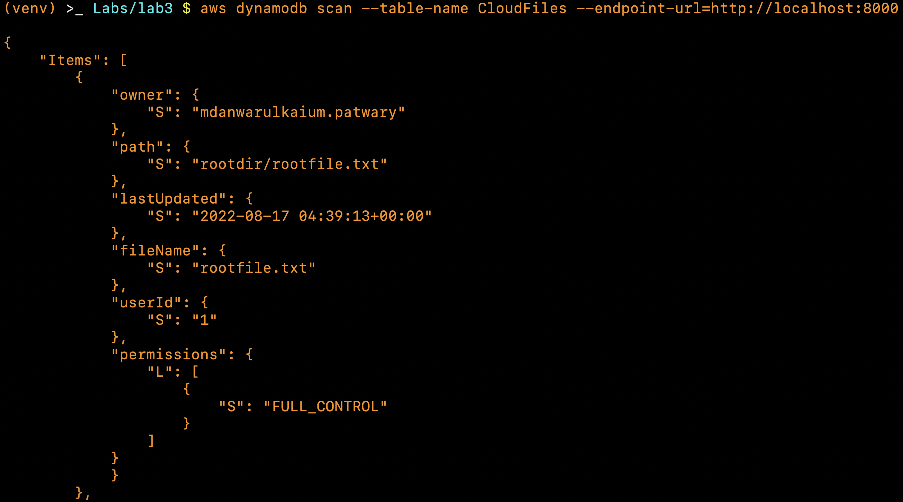

# Practical Worksheet 3

## Program

### Preparation

Create a directory rootdir

Create a file in rootdir called rootfile.txt and put some content in it "1\n2\n3\n4\n5\n"

Create a second directory in rootdir called subdir and create another file subfile.txt with the same content as rootfile.txt


### Save to S3

```python
'''
cloudstorage.py

Skeleton application to copy local files to S3

Given a root local directory, will return files in each level and
copy to same path on S3
'''
import os
import sys
import boto3
from lab3 import ROOT_S3_DIR

s3 = boto3.resource("s3")
bucket_config = {'LocationConstraint': 'ap-southeast-2'}

def upload_file(file):
    s3.meta.client.upload_file(file, ROOT_S3_DIR, file)
    print("Uploading %s" % file)

# create bucket if not there
argv = sys.argv[1:]
if len(argv) == 1 and argv[0] in ['-i', '--initialise=True']:
    try:
        response = boto3.client("s3").create_bucket(
            Bucket=ROOT_S3_DIR,
            CreateBucketConfiguration=bucket_config,
        )
        print(response)
    except Exception as error:
        print(error)

# parse directory and upload files
for dir_name, subdir_list, file_list in os.walk('rootdir', topdown=True):
    for fname in file_list:
        upload_file(f'{dir_name}/{fname}')

print("done")
```

Run `cloudstorage.py`.


If `-i` or `--initialise=True` is passed in as commandline arguments it will try to create a `S2` bucket, if the bucket already exists it will print an error. Otherwise it will just upload the files without trying to create a bucket first.


### Restore from S3

```python
'''restorefromcloud.py'''
import os
import boto3
from lab3 import ROOT_S3_DIR

client = boto3.client("s3")
s3 = boto3.resource('s3')

for content in client.list_objects(Bucket=ROOT_S3_DIR)['Contents']:
    paths = content['Key'].split('/')
    # create the directories listed in the path
    for dir in paths[:-1]:
        if not os.path.isdir(dir):
            os.mkdir(dir)
        os.chdir(dir)
    # download the file from S3 to the deepest directory
    s3.meta.client.download_file(ROOT_S3_DIR, content['Key'], paths[-1])
    # go back to the root directory
    for i in range(len(paths) - 1):
        os.chdir('..')
```

Run `restorefromcloud.py`.


First delete the `rootdir` directory so the file structure can be restored from the cloud exactly the way it was before deleting.

### Write information about files to DynamoDB

Create a directory for DynamoDB.


Install DynamoDB from `aws` and unzip it.


Run DynamoDB using Java.


Create a table on your local DynamoDB with the key `userId`.

For every file that is stored in S3, get the information to put in the DynamoDB item and write it to the table. You will have to find functions in Python to get details like time lastUpdated, owner and permissions. All of this information can be stored as strings.

```python
'''lab3.py'''
import boto3

ROOT_S3_DIR = '23344153-cloudstorage'
TABLE_NAME='CloudFiles'

dynamodb = boto3.client('dynamodb', endpoint_url='http://localhost:8000')
s3 = boto3.client("s3")

if __name__ == '__main__':
    # create table if not exists
    try:
        dynamodb.create_table(
            TableName=TABLE_NAME,
            AttributeDefinitions=[
                {
                    'AttributeName': 'userId',
                    'AttributeType': 'S'
                },
            ],
            KeySchema=[
                {
                    'AttributeName': 'userId',
                    'KeyType': 'HASH',
                },
            ],
            ProvisionedThroughput={
                'ReadCapacityUnits': 1,
                'WriteCapacityUnits': 1
            },
        )
    except Exception as error:
        print(error)

    # scan table to find the number of items
    items = dynamodb.scan(TableName=TABLE_NAME)['Items']
    # set the userId to be 0 if there is no items otherwise the last item's userId
    userId = int(items[-1]['userId']['S']) if len(items) > 0 else 0

    for content in s3.list_objects(Bucket=ROOT_S3_DIR)['Contents']:
        # the userId key will be the last item's userId + 1
        userId += 1
        path = content['Key']
        filename = path.split('/')[-1]
        # get all the attributes from S3
        response = s3.get_object(
            Bucket=ROOT_S3_DIR,
            Key=path,
        )
        lastUpdated = response['LastModified']
        response = s3.get_object_acl(
            Bucket=ROOT_S3_DIR,
            Key=path,
        )
        owner = response['Owner']['DisplayName']
        permissions = [{ 'S': grant['Permission'] } for grant in response['Grants']]

        # put the file item in the table
        dynamodb.put_item(
            Item={
                'userId': {
                    'S': str(userId),
                },
                'fileName': {
                    'S': filename,
                },
                'path': {
                    'S': path,
                },
                'lastUpdated': {
                    'S': str(lastUpdated),
                },
                'owner': {
                    'S': owner,
                },
                'permissions': {
                    'L': permissions,
                },
            },
            ReturnConsumedCapacity='TOTAL',
            TableName=TABLE_NAME,
        )
```

Run `lab3.py`.


At first there is no table named `CloudFiles` on DynamoDB, after running `lab3.py` it then exists.




Scan the `CloudFiles` table using `awscli` and there should be 2 items as there are 2 files uploaded to S3. One is `rootfile.txt` with the full path of `rootdir/rootfile.txt` and the other is `subfile.txt` with the full path of `rootdir/subdir/subfile.txt`.
