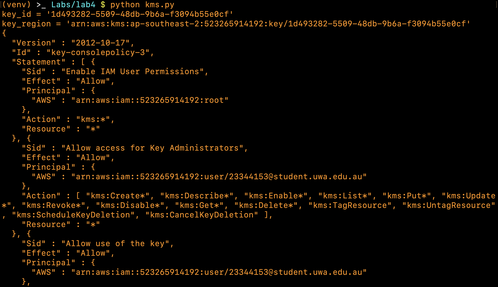

# Practical Worksheet 4

## Apply policy to restrict permissions on bucket


Before the bucket has no policy.

```json
{
    "Version": "2012-10-17",
    "Statement": {
        "Sid": "AllowAllS3ActionsInUserFolderForUserOnly",
        "Effect": "DENY",
        "Principal": "*",
        "Action": "s3:*",
        "Resource": "arn:aws:s3:::23344153-cloudstorage",
        "Condition": {
            "StringNotLike": {
                "aws:username":"23344153@student.uwa.edu.au"
            }
        }
    }
}
```

```python
'''apply_policy.py'''
import boto3
from lab4 import ROOT_S3_DIR
client = boto3.client('s3')

with open('policy.json', 'r') as policy:
    client.put_bucket_policy(
        Bucket=ROOT_S3_DIR,
        Policy=policy.read(),
    )
    print(client.get_bucket_policy(Bucket=ROOT_S3_DIR)['Policy'])
```

Running `apply_policy.py` to apply the policy in the `policy.json` file to the bucket.


The policy is now attached to the bucket and any other account that does not have the username `23344153@student.uwa.edu.au` has no permissions to view the bucket.


## AES Encryption using KMS

```json
{
    "Id": "key-consolepolicy-3",
    "Version": "2012-10-17",
    "Statement": [
        {
            "Sid": "Enable IAM User Permissions",
            "Effect": "Allow",
            "Principal": {
                "AWS": "arn:aws:iam::523265914192:root"
            },
            "Action": "kms:*",
            "Resource": "*"
        },
        {
            "Sid": "Allow access for Key Administrators",
            "Effect": "Allow",
            "Principal": {
                "AWS": "arn:aws:iam::523265914192:user/23344153@student.uwa.edu.au"
            },
            "Action": [
                "kms:Create*",
                "kms:Describe*",
                "kms:Enable*",
                "kms:List*",
                "kms:Put*",
                "kms:Update*",
                "kms:Revoke*",
                "kms:Disable*",
                "kms:Get*",
                "kms:Delete*",
                "kms:TagResource",
                "kms:UntagResource",
                "kms:ScheduleKeyDeletion",
                "kms:CancelKeyDeletion"
            ],
            "Resource": "*"
        },
        {
            "Sid": "Allow use of the key",
            "Effect": "Allow",
            "Principal": {
                "AWS": "arn:aws:iam::523265914192:user/23344153@student.uwa.edu.au"
            },
            "Action": [
                "kms:Encrypt",
                "kms:Decrypt",
                "kms:ReEncrypt*",
                "kms:GenerateDataKey*",
                "kms:DescribeKey"
            ],
            "Resource": "*"
        },
        {
            "Sid": "Allow attachment of persistent resources",
            "Effect": "Allow",
            "Principal": {
                "AWS": "arn:aws:iam::523265914192:user/23344153@student.uwa.edu.au"
            },
            "Action": [
                "kms:CreateGrant",
                "kms:ListGrants",
                "kms:RevokeGrant"
            ],
            "Resource": "*",
            "Condition": {
                "Bool": {
                    "kms:GrantIsForAWSResource": "true"
                }
            }
        }
    ]
}
```

```python
'''kms.py'''
import boto3
client = boto3.client('kms')

with open('key_policy.json', 'r') as policy:
    # create a key with a KMS policy
    response = client.create_key(
        Policy=policy.read(),
    )
    key_id = response['KeyMetadata']['KeyId']
    key_region = response['KeyMetadata']['Arn']
    print(f'{key_id = }\n{key_region = }')

    # add an alias
    try:
        client.create_alias(
            AliasName='alias/23344153',
            TargetKeyId=key_id
        )
    except:
        pass

    # output the policy
    print(client.get_key_policy(
        KeyId=key_id,
        PolicyName='default'
    )['Policy'])

    # generate a data key for encryption
    data_key = client.generate_data_key(
        KeyId=key_id,
        KeySpec='AES_256'
    )
    data_key_encrypted = data_key['CiphertextBlob']
    data_key = data_key['Plaintext']
    print(f"{data_key_encrypted = }\n{data_key = }")
```

Running `kms.py`.




```python
'''
lab4.py

Sample application to encrypt and decrypt files using AES
'''
import os, struct
from Crypto.Cipher import AES
from Crypto import Random
import hashlib

ROOT_S3_DIR = '23344153-cloudstorage'
CHUNK_SIZE = 64 * 1024

def encrypt_file(key, file):

    iv = Random.new().read(AES.block_size)
    encryptor = AES.new(key, AES.MODE_CBC, iv)
    filesize = os.path.getsize(file)

    with open(file, 'rb') as infile:
        with open(f'{file}.enc', 'wb') as outfile:
            outfile.write(struct.pack('<Q', filesize))
            outfile.write(iv)

            while True:
                chunk = infile.read(CHUNK_SIZE)
                if len(chunk) == 0:
                    break
                elif len(chunk) % 16 != 0:
                    chunk += ' '.encode("utf-8") * (16 - len(chunk) % 16)

                outfile.write(encryptor.encrypt(chunk))

def decrypt_file(key, file):

    with open(file, 'rb') as infile:
        origsize = struct.unpack('<Q', infile.read(struct.calcsize('Q')))[0]
        iv = infile.read(16)
        decryptor = AES.new(key, AES.MODE_CBC, iv)

        with open(f'{file}.dec', 'wb') as outfile:
            while True:
                chunk = infile.read(CHUNK_SIZE)
                if len(chunk) == 0:
                    break
                outfile.write(decryptor.decrypt(chunk))

            outfile.truncate(origsize)

password = 'password'
key = hashlib.sha256(password.encode("utf-8")).digest()
if __name__ == '__main__':
    encrypt_file(key, "test.txt")
    decrypt_file(key, "test.txt.enc")
```

```python
'''
cloudstorage.py

Skeleton application to copy local files to S3

Given a root local directory, will return files in each level and
copy to same path on S3
'''
import os
import sys
import boto3
import base64
from lab4 import ROOT_S3_DIR, key, encrypt_file

client = boto3.client('s3')
s3 = boto3.resource('s3')

# create bucket if not there
argv = sys.argv[1:]
if len(argv) > 0 and '-i' in argv:
    try:
        response = client.create_bucket(
            Bucket=ROOT_S3_DIR,
            CreateBucketConfiguration={
                'LocationConstraint': 'ap-southeast-2'
            },
        )
        print(response)
    except Exception as error:
        print(error)

def upload_file(file):
    out_filename = f'{file}.enc'
    if '-k' in argv:
        # KMS
        from kms import data_key, data_key_encrypted
        encrypt_file(data_key, file)
        client.put_object(
            Body=open(out_filename, 'rb'),
            Bucket=ROOT_S3_DIR,
            # enable SSE-KMS
            ServerSideEncryption='aws:kms',
            Key=file,
            # put encrypted data key in the metadata so the data key can
            # be obtained by decrypting the encrypted data key
            Metadata={
                'encryption-key': base64.b64encode(data_key_encrypted).decode()
            }
        )
        print("Uploading %s" % out_filename)
    elif '-c' in argv:
        # using a hash key to encrypt
        encrypt_file(key, file)
        s3.meta.client.upload_file(out_filename, ROOT_S3_DIR, file)
        print("Uploading %s" % out_filename)
    else:
        # upload files unencrypted
        s3.meta.client.upload_file(file, ROOT_S3_DIR, file)
        print("Uploading %s" % file)

# parse the current directory and upload all the text files
for dir_name, subdir_list, file_list in os.walk('.', topdown=True):
    for fname in file_list:
        # only upload files with a txt extension
        if fname.endswith('.txt'):
            upload_file(f'{dir_name}/{fname}')

print("done")
```

```python
'''restorefromcloud.py'''
import os
import sys
import boto3
import base64
from lab4 import ROOT_S3_DIR, key, decrypt_file

client = boto3.client('s3')
s3 = boto3.resource('s3')
kms = boto3.client('kms')

argv = sys.argv[1:]
for content in client.list_objects(Bucket=ROOT_S3_DIR)['Contents']:
    paths = content['Key'].split('/')
    file = paths[-1]
    # create the directories listed in the path
    for dir in paths[:-1]:
        if not os.path.isdir(dir):
            os.mkdir(dir)
        os.chdir(dir)
    # download the file from S3 to the deepest directory
    s3.meta.client.download_file(ROOT_S3_DIR, content['Key'], file)

    if len(argv) == 1:
        # using KMS data key to decrypt
        if argv[0] in ['-k', '--kms=True']:
            key = client.get_object(
                Bucket=ROOT_S3_DIR,
                Key=content['Key']
            )['Metadata']['encryption-key']
            # decrypt the encrypted data key from the meta data first
            decrypt_file(
                kms.decrypt(CiphertextBlob=base64.b64decode(key))['Plaintext'],
                file
            )
        # using a hash key to decrypt
        elif argv[0] in ['-c', '--crypto=True']:
            decrypt_file(key, file)

    # go back to the root directory
    for i in range(len(paths) - 1):
        os.chdir('..')
```

Running `cloudstorage.py` uploads the file that has been encrypted locally to `S3`.

Running `restorefromcloud.py` downloads the encrypted file and decrypt it locally to view the original content.

With the `-k` flag it uses the data key generated from the `KMS customer managed key` created earlier for encryption and also adds Server-side encryption.


Server-side encryption is set to `SSE-KMS`.


## AES Encryption using local python library pycryptodome

Running `cloudstorage.py` and `restorefromcloud.py` with the `-c` flag to use a custom hash as the symmetric key for encryption and decryption.


Server-side encryption is disabled.


What is the performance difference between using `KMS` and using the custom solution?


I constructed a slightly larger file structure to compare the performance of the different approaches to encryption. The result is using `KMS` for encryption and `SSE-KMS` is slightly slower than the custom solution. However I would still use `KMS` because there are separate permissions for the use of a `KMS` key which provides added protection against unauthorised access to objects in `S3` and `SSE-KMS` also provides an audit trail that shows when the `KMS` key was used and by whom.
