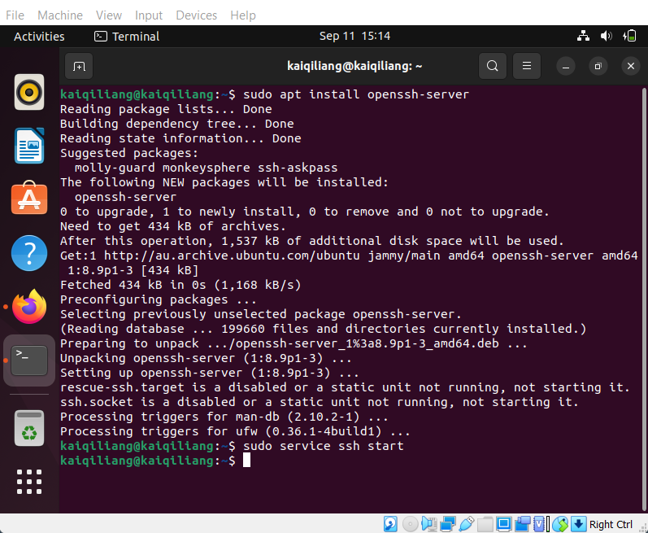
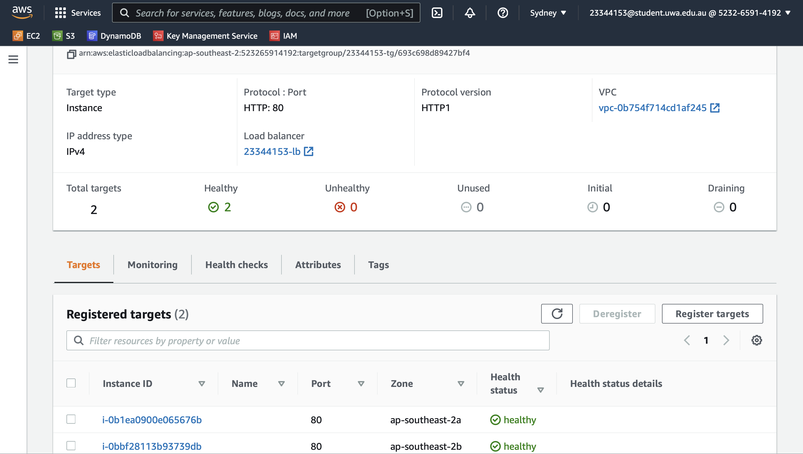

# Practical Worksheet 5

## Configure inbound IP on VirtualBox VM

In the VirtualBox Manager, select the VM you want to configure, then click Settings (Golden Gear Cog) and Network. Adapter 1 should be configured as NAT. Click on Advanced and then Port Forwarding. Set up 2 rules:

* Use the localhost host IP 127.0.0.1 and host port 2222 and map that to Guest Port 22.
* Add a similar rule mapping Host Port 8080 to Guest Port 80.


Test the NAT ports by running `apache2` docker app on the VM.


Now open [localhost](http://localhost) on the VM.


Open [localhost:8080](http://localhost:8080) in a browser on the local machine and it should show the exact same thing as on the VM.


Enable ssh to the VM by installing `openssh-server` and start the ssh service.



SSH into the VM from a terminal.


Stop the ssh service.


SSH will not connect after it is stopped.


## Setting up an Application Load Balancer

```python
'''lab5.py'''
import boto3

ec2 = boto3.client('ec2')
elb = boto3.client('elbv2')

# get the availability zones from the region and get the first two
availability_zones = sorted(
    [
        (
            availability_zone['SubnetId'],
            availability_zone['AvailabilityZone']
        )
        for availability_zone in ec2.describe_subnets()['Subnets']
    ], key=lambda availability_zone: availability_zone[1]
)[:2]

# create security group for the instances and load balancer
security_group_id = ec2.create_security_group(
    GroupName='23344153-sg',
    Description='Security Group'
)['GroupId']

# add inbound rule for the given security group ID
data = ec2.authorize_security_group_ingress(
    GroupId=security_group_id,
    IpPermissions=[
        {
            'IpProtocol': 'tcp',
            'FromPort': 22,
            'ToPort': 22,
            'IpRanges': [{'CidrIp': '0.0.0.0/0'}]
        },
        {
            'IpProtocol': 'tcp',
            'FromPort': 80,
            'ToPort': 80,
            'IpRanges': [{'CidrIp': '0.0.0.0/0'}]
        }
    ]
)

# create two EC2 instances in two different availability zones of a specific region
instances = []
for _, availability_zone in availability_zones:
    instance = boto3.resource('ec2').create_instances(
        ImageId='ami-d38a4ab1',
        MaxCount=1,
        MinCount=1,
        InstanceType='t2.micro',
        KeyName='23344153-key',
        SecurityGroupIds=[security_group_id],
        Placement={
            'AvailabilityZone': availability_zone
        }
    )[0]
    instances.append(instance.id)
    instance.wait_until_running()
    print(ec2.describe_instances(InstanceIds=[instance.id])['Reservations'][0]['Instances'][0]['PublicIpAddress'])

# create the Application Load Balancer
load_balancer = elb.create_load_balancer(
    Name='23344153-lb',
    SecurityGroups=[security_group_id],
    Subnets=[subnet for subnet, _ in availability_zones]
)['LoadBalancers'][0]['LoadBalancerArn']

# create a target group using the same VPC that was used to create the instances
target_group = elb.create_target_group(
    Name='23344153-tg',
    Protocol='HTTP',
    Port=80,
    VpcId=ec2.describe_vpcs()['Vpcs'][0]['VpcId']
)['TargetGroups'][0]['TargetGroupArn']

# register targets in the target group
elb.register_targets(
    TargetGroupArn=target_group,
    Targets=[{ 'Id': instance } for instance in instances]
)

# create a listener with a default rule Protocol: HTTP and Port 80 forwarding on to the target group
elb.create_listener(
    LoadBalancerArn=load_balancer,
    DefaultActions=[
        {
            'TargetGroupArn': target_group,
            'Type': 'forward',
        },
    ],
    Protocol='HTTP',
    Port=80,
)
```

Run `lab5.py`.


Check the instances on AWS console.


Install `apache2` on each instance.


Edit the `/var/www/html/index.html` file to report the instance name.


Accessing instance A using its public IP address.


Accessing instance B using its public IP address after the going through the same process as instance A.


Check the Application Load Balancer on AWS console.


Check the target group on AWS console.


Check the registered targets on AWS console.



Verify that the load balancer is working by using the same DNS name to access both of the EC2 instances by refreshing the page.


Delete the load balancer.


