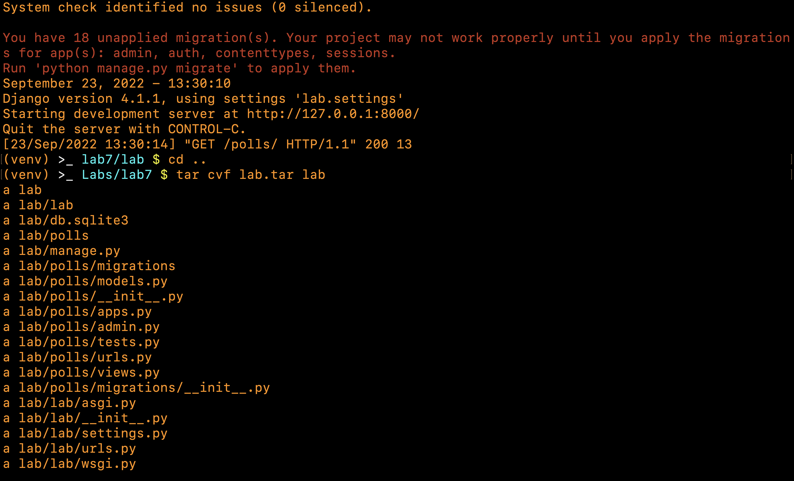

# Practical Worksheet 7

## Create an EC2 instance


## Install and configure Fabric

Install `fabric`.


Create a config file in `~/.ssh` and test `fabric` from the command line.


## Write a python script to automate the installation of nginx

```python
'''
lab7.py
'''
from fabric import Connection
conn = Connection('ec2')

res = conn.sudo('apt-get update')
res = conn.sudo('apt-get upgrade')
res = conn.sudo('apt install nginx')
res = conn.put('default', 'default')
res = conn.sudo('mv default /etc/nginx/sites-enabled/default')
res = conn.sudo('service nginx restart')
```

Create a `default` file to be copied to the EC2 instance to replace the `/etc/nginx/sites-enabled/default` file.


Run `lab7.py`.


## Update the python script to install your Django app

```python
'''
lab7.py
'''
from fabric import Connection
conn = Connection('ec2')

res = conn.sudo('apt-get update')
res = conn.sudo('apt-get upgrade')
res = conn.sudo('apt install nginx')
res = conn.put('default', 'default')
res = conn.sudo('mv default /etc/nginx/sites-enabled/default')
res = conn.sudo('service nginx restart')

res = conn.sudo('apt install python3-pip')
res = conn.sudo('pip install django')
res = conn.sudo('mkdir -p /opt/wwc/mysites')
res = conn.put('lab.tar', 'lab.tar')
res = conn.sudo('tar xf lab.tar -C /opt/wwc/mysites/')
res = conn.run('cd /opt/wwc/mysites/lab; sudo python3 manage.py runserver 8000')
```

Set up `django` locally and create a tar file of the entire app.




Run the updated `lab7.py` to install `django` and run the server on the EC2 instance.


Go to a browser and enter the public IP address of the ec2 instance.


