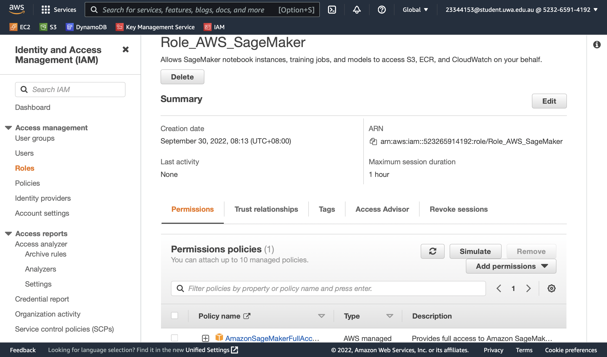
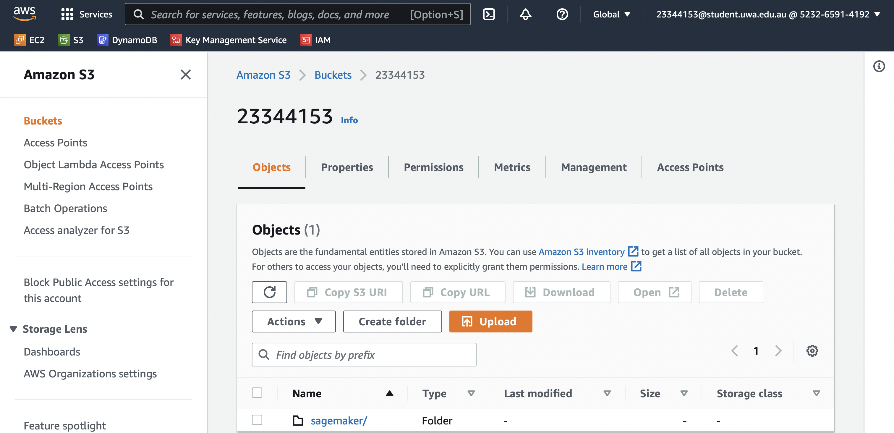
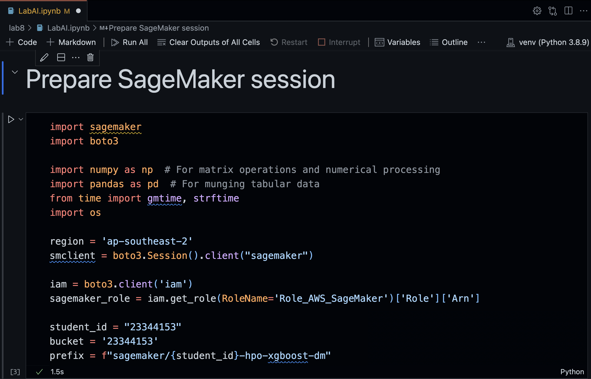
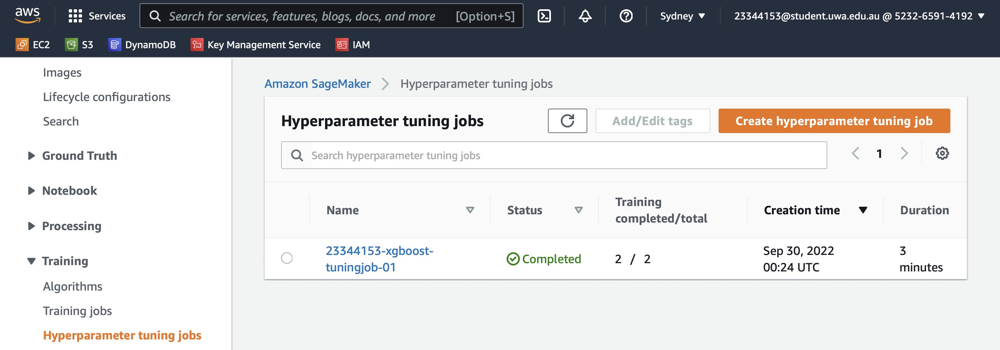
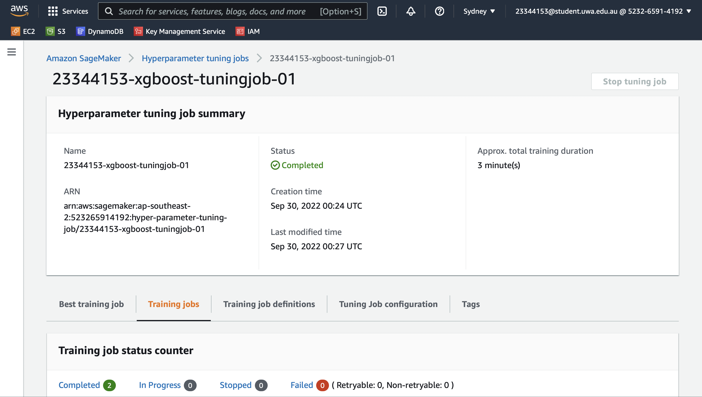
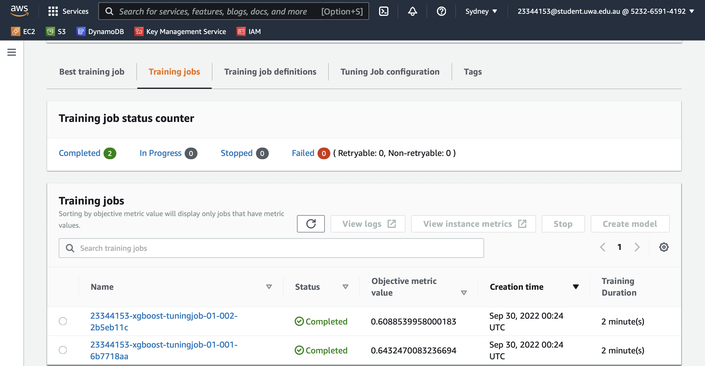
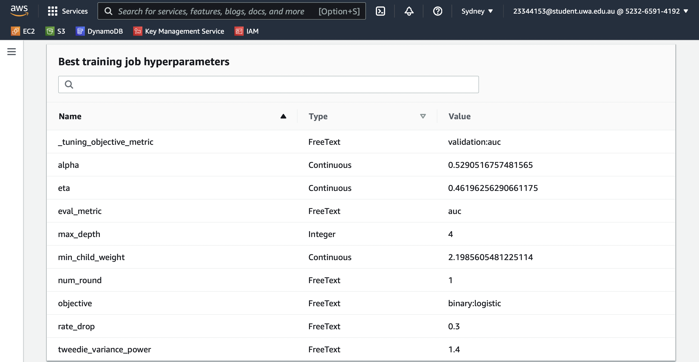
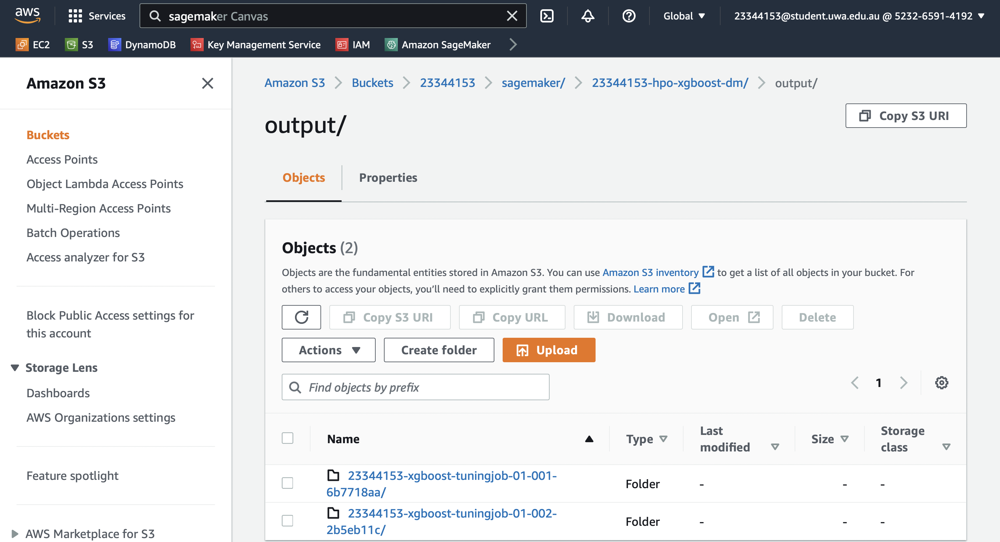

# Practical Worksheet 8

## Set Up Python Environment

## Run Hyperparameter Tuning Jobs

Create an IAM role to get access to the `SageMaker` service for hyperparameter tuning.

Create a bucket to to put the training data as well as the output from the training job.

Change bucket name in the session prepration cell.

Run the rest of the code cells then monitor the progress of the hyperparameter tuning job.

These are the hyperparameters of the best training job.

The output is stored in the same bucket by `SageMaker`.

