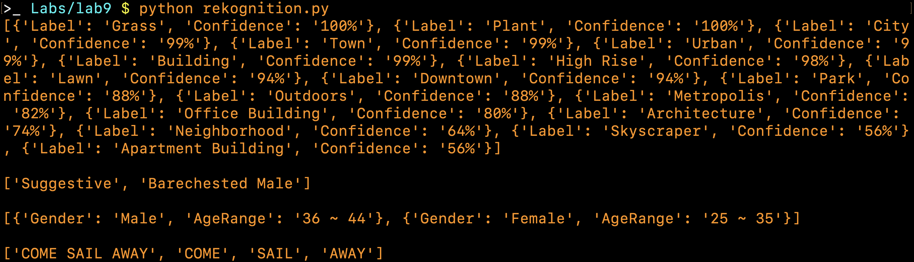

# Practical Worksheet 9

## AWS Comprehend

```python
'''
comprehend.py
'''
import boto3
import iso639
client = boto3.client('comprehend')

while True:
    text = input()
    print()

    response = client.detect_dominant_language(Text=text)['Languages'][0]
    code = response['LanguageCode']
    language = iso639.languages.get(part1 = code).name
    confidence = round(response['Score'] * 100)
    print(f'{language} detected with {confidence}% confidence', end='\n\n')

    response = client.detect_sentiment(Text=text, LanguageCode=code)
    sentiment = response['Sentiment'].capitalize()
    confidence = round(response['SentimentScore'][sentiment] * 100)
    print(f'{sentiment} detected with {confidence}% confidence', end='\n\n')

    response = client.detect_entities(Text=text, LanguageCode=code)['Entities']
    print([f"{entity['Type']}: {entity['Text']}" for entity in response], end='\n\n')

    response = client.detect_key_phrases(Text=text, LanguageCode=code)['KeyPhrases']
    print([keyphrase['Text'] for keyphrase in response], end='\n\n')

    response = client.detect_syntax(Text=text, LanguageCode=code)['SyntaxTokens']
    print([syntax['Text'] for syntax in response], end='\n\n')
```

Run `comprehend.py` and input 4 different languages, each one prints out the language and sentiment with confidence value, then a list of labels, key phrases and syntax tokens.


## AWS Rekognition

```python
'''
rekognition.py
'''
import boto3
rekognition = boto3.client('rekognition')
s3 = boto3.resource("s3")

BUCKET = '23344153'
URBAN = 'images/urban.jpeg'
BEACH = 'images/beach.jpeg'
PEOPLE = 'images/people.jpeg'
TEXT = 'images/text.jpeg'

s3.create_bucket(
    Bucket=BUCKET,
    CreateBucketConfiguration={'LocationConstraint': 'ap-southeast-2'},
)

for image in [URBAN, BEACH, PEOPLE, TEXT]:
    s3.meta.client.upload_file(image, BUCKET, image)

response = rekognition.detect_labels(
    Image={
        'S3Object': {
            'Bucket': BUCKET,
            'Name': URBAN,
        }
    }
)['Labels']
print([label['Name'] for label in response], end='\n\n')

response = rekognition.detect_moderation_labels(
    Image={
        'S3Object': {
            'Bucket': BUCKET,
            'Name': BEACH,
        }
    }
)['ModerationLabels']
print([label['Name'] for label in response], end='\n\n')

response = rekognition.detect_faces(
    Image={
        'S3Object': {
            'Bucket': BUCKET,
            'Name': PEOPLE,
        }
    }
)['FaceDetails']
print(response, end='\n\n')

response = rekognition.detect_text(
    Image={
        'S3Object': {
            'Bucket': BUCKET,
            'Name': TEXT,
        }
    }
)['TextDetections']
print([text['DetectedText'] for text in response])
```

Run `rekognition.py` which creates a S3 bucket and uploads 4 images, then run label recognition, image moderation, facial analysis and text extration.


